==================
Angular directives
==================

.. highlight:: html

------------
smoModelView
------------

This directive handles the communication with the server via a communicator object. The communicator is responsible for
sending AJAX requests to carry out specific actions, 
such as fetching the initial data needed to visualise the model or sending input values to make calculations.
Through the communicator, the directive is also able to inform the user about an unsuccessful outcome of the communication 
by displaying error messages::      

   

**Restrict:** Attribute

**Scope:** Yes

**Parameters:**
   * **smo-model-view** - The name of the view being visualised
   * **model-name** - The name of the model, whose view is being visualised
   * **view-type** - The display type of the model. Valid strings are:
      * *input*
      * *output*
   * **auto-fetch** - Boolean value, indicating whether the view should be automatically loaded
   * **view-record-id** - ID of record of values of the view persisted in a MongoDB database

**Uses:** *smoSuperGroupSet*, *smoViewToolbar*

----------------
smoSuperGroupSet
----------------

Displays a set of super-groups, each of which consists of one or more field-groups and/or view-groups.
Multiple super-groups are displayed in tabs::

   

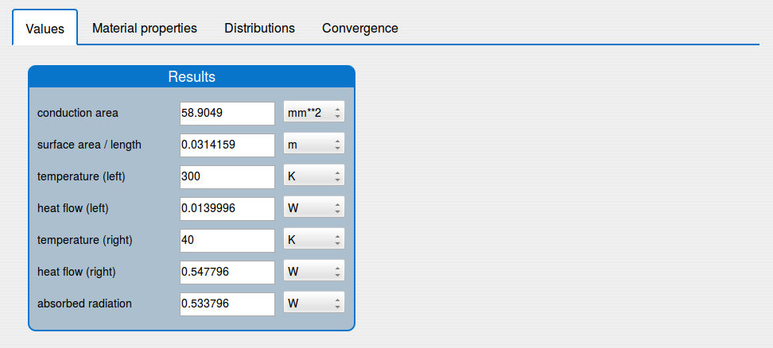
   
   Super-group set

**Restrict:** Attribute

**Scope:** Yes

**Parameters:**
   * **smo-super-group-set** - An object defining the set of super-groups
   * **model-name** - The name of the model
   * **view-type** - The display type of the super-groups in the set. Valid strings are:
      * *input*
      * *output*
   * **smo-data-source** - An object containing the values of the fields that are part of the super-groups in the set

**Uses:** *smoSuperGroup*

-------------
smoSuperGroup
-------------

Used for displaying a super-group::

   

   
**Restrict:** Attribute

**Scope:** Yes

**Parameters:**
   * **smo-super-group** - An object defining the super-group
   * **view-type** - The display type of the super-group, which also applies to the field-groups and/or view-groups it contains. Valid strings are:
      * *input*
      * *output*
   * **smo-data-source** - An object containing the values of the fields in the super-group

 
**Uses:** *smoFieldGroup*, *smoViewGroup*

-------------
smoFieldGroup
-------------

Visualizes a basic group of fields. Each field-group is displayed as a delimited colored area containing 
a label and stacked fields::

   

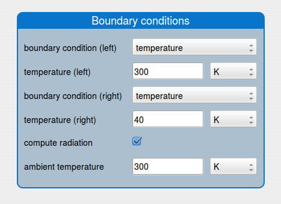
   
   Field-group
   
**Restrict:** Attribute

**Scope:** Yes

**Parameters:**
   * **smo-field-group** - An object defining the field-group
   * **view-type** - The display type of the field-group, which applies also to all its fields. Valid strings are:
      * *input*
      * *output*
   * **smo-data-source** - An object containing the values of the fields making up the field-group
   
**Uses:** *smoQuantity*, *smoChoice*, *smoString*, *smoBool*, *smoRecordArray*

------------
smoViewGroup
------------

Displays a grouping of data series (plot or table) and image fields. Each view-group is visualized as a delimited area with pill navigation
on the left for switching among its fields::

   

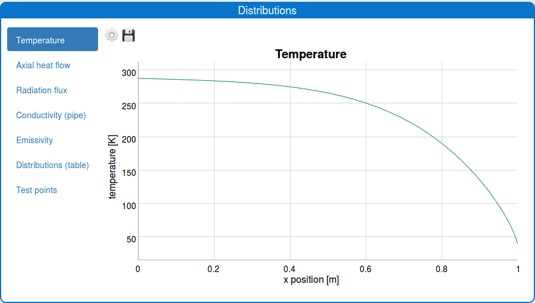
  

   View-group
   
**Restrict:** Attribute

**Scope:** Yes

**Parameters:**
   * **smo-view-group** - An object defining the view-group
   * **model-name** - The name of the model
   * **smo-data-source** - An object containing the values of the fields making up the view-group
   
**Uses:** *smoDataSeriesView*, *smoImg*

-----------
smoQuantity
-----------

Visualizes a quantity input or output field with unit conversion functionality. In the case of an input field,
value validation is also performed::
   
   

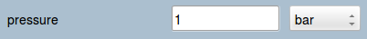

   Quantity field 

**Restrict:** Attribute

**Scope:** Yes

**Parameters:**
   * **view-type** - The display type of the field. Valid strings are:
      * *input*
      * *output*
   * **field-var** - An object defining the field
   * **smo-data-source** - An object containing the value of the field  

---------
smoChoice
---------

Visualizes a field for selecting a value from a dropdown list of options::
   
   

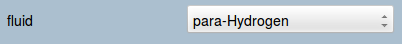

   Choice field 

**Restrict:** Attribute

**Scope:** Yes

**Parameters:**
   * **field-var** - An object defining the field, including the list of options
   * **smo-data-source** - An object containing the value of the field  

---------
smoString
---------

Visualizes a field for input or output of single- or multi-line strings::
   
   

**Restrict:** Attribute

**Scope:** Yes

**Parameters:**
   * **view-type** - The display type of the field. Valid strings are:
      * *input*
      * *output*
   * **field-var** - An object defining the field, including the multi-line option
   * **smo-data-source** - An object containing the value of the field  

-------
smoBool
-------

Visualizes a field for handling boolean values. The directive creates a checkbox 
(if ``view-type`` is *input*) or *true*/*false* (if ``view-type`` is *output*)::
   
   

   
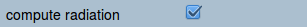

   Input boolean field 

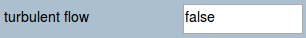

   Output boolean field

**Restrict:** Attribute

**Scope:** Yes

**Parameters:**
   * **view-type** - The display type of the field. Valid strings are:
      * *input*
      * *output*
   * **field-var** - An object defining the field
   * **smo-data-source** - An object containing the value of the field  

--------------
smoRecordArray
--------------

Displays a field for the input of an array of records. The structure of the records is a combination of the basic field types.
The array pops up in edit mode when an icon is clicked by the user::
   
   

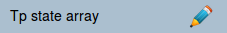

   Record array field in collapsed mode 
   
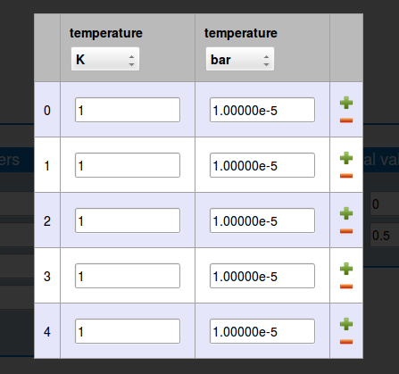

   Record array field in edit mode 

**Restrict:** Attribute

**Scope:** Yes

**Parameters:**
   * **smo-record-array** - An object defining the field
   * **smo-data-source** - An object containing the value of the field 
   
-----------------
smoDataSeriesView
-----------------
Displays a plot or table. The directive draws a plot of series of data using the `dygraphs`_ library 
and table using the `Google Charts`_ library. It allows for export in *png* and *csv* formats, respectively::

   

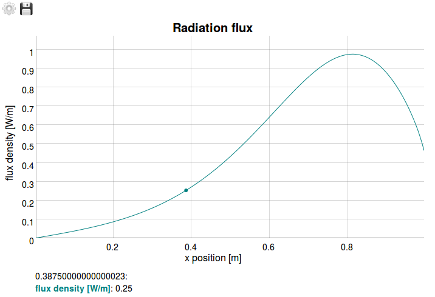

|
   
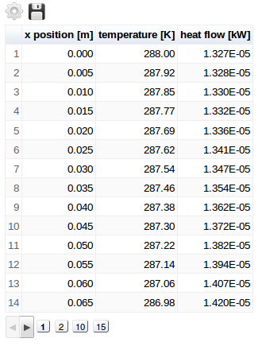
   
**Restrict:** Attribute

**Scope:** Yes

**Parameters:**
   * **field-var** - An object defining the field
   * **model-name** - The name of the model
   * **smo-data-source** - An object containing the value of the field

------
smoImg
------

Displays an image::

   

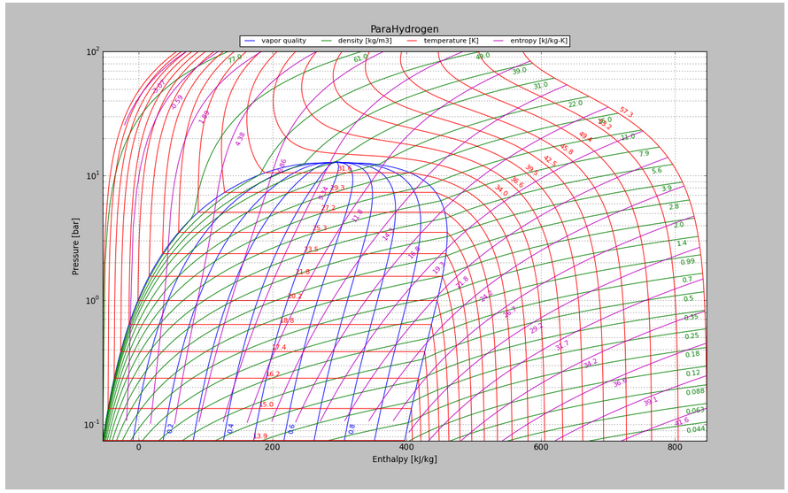
   
**Restrict:** Attribute

**Scope:** Yes

**Parameters:**
   * **field-var** - An object defining the field
   * **model-name** - The name of the model
   * **smo-data-source** - An object containing the value of the field

--------------
smoViewToolbar
--------------

A toolbar with buttons to perform actions in relation to a particular view::

   

**Restrict:** Attribute

**Scope:** Yes

**Parameters:**
   * **model** - Object representing the model
   * **view-name** - The name of the view
   * **actions** - Array of actions

**Uses:** *smoButton*

---------
smoButton
---------

Creates a button::
   
   <smo-button action="addRow(i)" icon="plus" tip="Inserts row at i-th index" size="md"></smo-button>

**Restrict:** Element

**Scope:** No

**Parameters:**
   * **action** - The function call on a click event
   * **icon** - The base name of a *.png* file containing the icon of the button
   * **tip** - A tooltip to appear on hover
   * **size** - The width of the button. Valid strings are:
      * *sm* - 16px, also the default value
      * *md* - 24px
      * *lg* - 32px
    
.. _dygraphs: http://dygraphs.com/
.. _Google Charts: https://developers.google.com/chart/