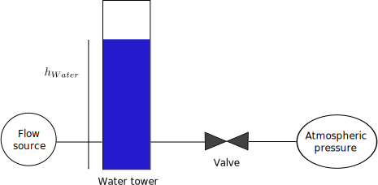
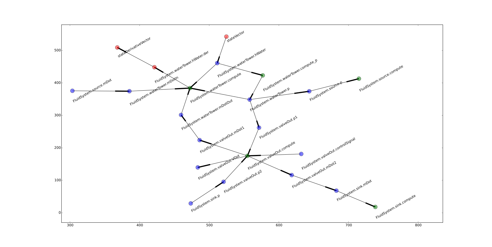
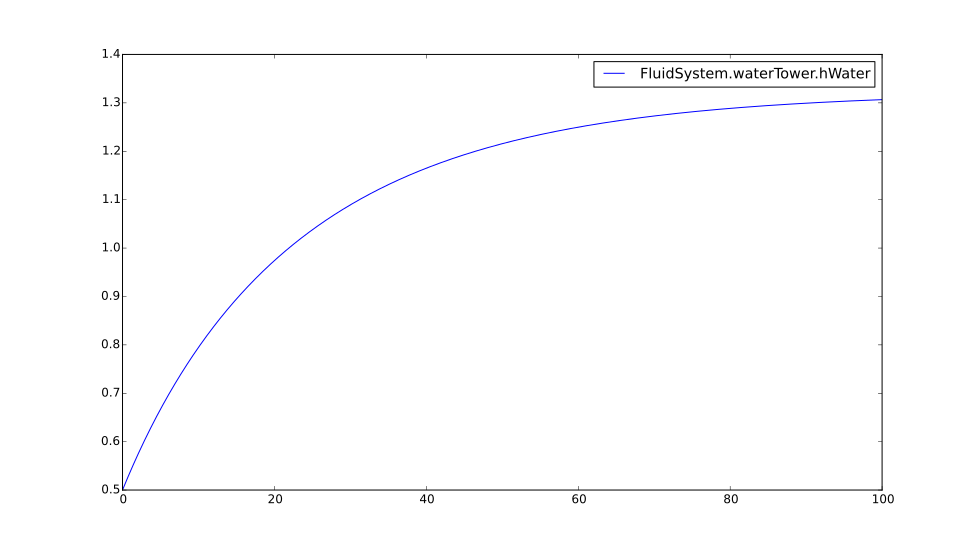
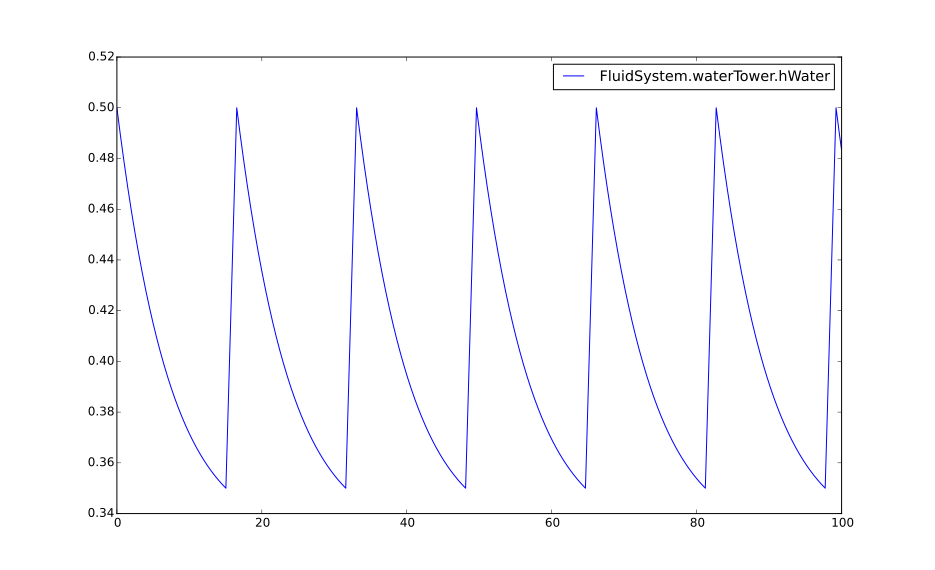

===============
Dynamical model
===============

.. |m2| replace:: m\ :sup:`2`

-------------------------
Defining dynamical models
-------------------------

Example model: water tower
--------------------------

Let's create a model for the hydraulic system shown in the figure:

   
   Water tower example circuit

The circuit consists of:

* a water source, with a constant flow rate of 100 kg/h
* a water tower (open vertical cylindrical container, with a cross-sectional area
  of 1 |m2|.
* a valve for the outflow from the tower, with K\ :sub:`v` = 1000
* an athmospheric pressure source ( 1 bar)    

The tower is being continuously filled with water from the water source, and emptied through the valve. The inlet mass
flow rate is constant, but as the level rises, the hydrostatic pressure inside rises and the outlet flow increases.
The water level approaches asymptotically a certain height, at which the two flows balance out. 

Let's define each component in Python. We start with the sources::

   class PressureSource(DynamicalModel):
      p = F.RealVariable(causality = CS.Output, variability = VR.Constant, default = 1e5)
      mDot =   F.RealVariable(causality = CS.Input)
      port = F.Port([p, mDot])
      
   class FlowSource(DynamicalModel):
      mDot =   F.RealVariable(causality = CS.Output, variability = VR.Constant, default = 100.0)
      p = F.RealVariable(causality = CS.Input)
      port = F.Port([p, mDot])

Each class representing a component must inherit from ``DynamicalModel``. Each model variable has:

* **type**: Real/Integer/Boolean etc. 
* **causality**: input/output/local/parameter
* **variability**: constant/discrete and continuous, the latter only in the case of real variables 

**Port** is a group of variables which facilitate interconnecting components.

The water tower model is defined as follows::

   class WaterTower(DynamicalModel):
      ACrossSection = F.RealVariable(causality = CS.Parameter, variability = VR.Constant,
                   default = 1.0)
      hWater = F.RealState(start = 0.5)
      mDotIn = F.RealVariable(causality = CS.Input)
      mDotOut = F.RealVariable(causality = CS.Input)
      p = F.RealVariable(causality = CS.Output)
      portIn = F.Port([p, mDotIn])
      portOut = F.Port([p, mDotOut])
      
      @F.Function(inputs = [hWater], outputs = [p])
      def compute_p(self, t):
         self.p = 1e5 + 1000 * 9.8 * self.hWater
   
      def compute(self, t):
         self.der.hWater = (self.mDotIn + self.mDotOut) / 1000. / self.ACrossSection

This model contains a state variable ``hWater`` with an initial value of 0.5. State variables (and more precisely continuous states) 
are variables which describe the time evolution of the system. They are continuous (under normal conditions) and their value at each
time instant is computed by the integrator. The user has to compute the **derivative** of the state variables (in our case
``self.der.hWater``).
The model has a ``compute()`` method, which will be called on each integration step. All the *input* variables and all the *state*
variables of the model will be inputs for this function, and it must set values for all *output* variables and *continuous state derivatives*.
The model also contains one additional method ``compute_p()`` which will be discussed later.
   
The valve model can be defined as::

   class Valve(DynamicalModel):
      Kv = F.RealVariable(causality = CS.Parameter, variability = VR.Constant, default = 1000.)
      VDot = F.RealVariable(causality = CS.Output)
      mDot1 = F.RealVariable(causality = CS.Output)
      mDot2 = F.RealVariable(causality = CS.Output)
      p1 = F.RealVariable(causality = CS.Input)
      p2 = F.RealVariable(causality = CS.Input)
      controlSignal = F.RealVariable(causality = CS.Input, default = 1.)
      port1 = F.Port([p1, mDot1])
      port2 = F.Port([p2, mDot2])
   
      def compute(self, t):
         N1 = 8.784e-07;
         if (self.p1 > self.p2):
            self.VDot = N1 * self.Kv * m.sqrt((self.p1 - self.p2) / 1.0)
            self.mDot2 = 1000 * self.VDot * self.controlSignal
            self.mDot1 = - self.mDot2
         else:
            self.VDot = 0
            self.mDot2 = 0
            self.mDot1 = 0
         print self.mDot1

Now let's define a fluid system, containing all the components connected as in the figure::

   class FluidSystem(DynamicalModel):
      source = F.SubModel(FlowSource)
      waterTower = F.SubModel(WaterTower)
      valveOut = F.SubModel(Valve)
      sink = F.SubModel(PressureSource)

      def __init__(self):
         self.source.meta.port.connect(self.waterTower.meta.portIn)
         self.waterTower.meta.portOut.connect(self.valveOut.meta.port1)
         self.valveOut.meta.port2.connect(self.sink.meta.port)

Using the ``SubModel`` type, we can define dynamical models as part of a larger model. We can access component ports through the ``meta`` property,
and connect them through the ``connect()`` method. This effectively connects the respective variables in the port groups.

----------------------------------
Analyzing and simulating the model
----------------------------------

Dynamical models, like the one we defined, are described by a set of ordinary differential equations. These equations are solved
numerically using fixed or variable step solvers. Both types of solvers require the user to define a set of 'user' functions,
which will be automatically called during the integration process. The most important ones are:

* ``init``: a function which initializes all the model data; it is called at the beginning of the simulation
* ``compute``: a function which is called at each time step, with the purpose of computing all the state variable derivatives.
  Inputs to the function are the values of the state variables (computed by the solver) and the solver expects to get back 
  the values of all the continuos state derivatives. 

Therefore, before we can run a simulation, the top level model (in this case FluidSystem) must be analyzed and the user functions
generated. The analysis collects information
about the variables and subcomponents in the model, about all the connections and dependencies, and creates a dependency graph for all the variables.
Using the information from this graph, the individual computational methods can be sorted in an execution sequence, such that each computational function is called,
only after all of its inputs are already calculated. Let's illustrate this with the case of the water tower model.

   
   Dependency graph for the water tower example

The green dots represent computational functions of the individual components, the blue dots represent component variables and the red dots represent
some special variables:

* ``stateVector``: the list of all the states, supplied by the integrator; this is the starting point for the calculations
* one dot for each derivative of each state variable (in this case ``FluidSystem.waterTower.hWater.der``)
* ``stateDerivativeVector``: the list of all the state derivatives sent to the integrator; this is the endpoint for the calculations

The direction of the arrows indicates the flow of information.

To generate the dependency graph the following information is used:

* causality of component variables (inputs/outputs for the computational functions)
* connections between variables

Once the dependency graph is available, performing a topolgical sort puts the nodes in proper order: a node whose value
depends on other nodes will be found behind these nodes in the sorted sequence. Now we can trace the graph and generate 
a simulation sequence containing the following actions:

* for each continuous state variable copy the value from the state vector
* if a node is a function, execute that function
* if a node is a variable, and this variable has a predecessor, which is another variable,
  copy the value of the predecessor variable to the successor variable
* finally, for each state derivative, copy its value to the state derivative vector

Now let's go back and see why we need the extra ``compute_p`` function. As we can see on the graph, if we didn't have this function, a problem
would arise: in order to compute ``FluidSystem.valveOut.mDot1``, the value of ``FluidSystem.waterTower.p`` is needed, but 
had we not defined the  ``compute_p`` function, this value would have had to be calculated in the ``FluidSystem.waterTower.compute`` function,
which needs ``FluidSystem.valveOut.mDot1`` as input. The topological sort on this graph, containing a dependency cycle, would have failed, and no
proper simulation sequence could have been generated. The cycle would have been caused by imprecise specifications of dependencies;
in reality ``FluidSystem.waterTower.p`` depends only on the water level, which is a state variable and is available as input since
the start of the time step. Defining ``compute_p`` breaks the dependency loop and permits a sequential computation of all the 
variables. If ``FluidSystem.waterTower.p`` was a state variable, the ``compute_p`` function would not have been necessary because state
variables values are always available for calculations even at the beginning of the time step.

Once the simulation sequence is generated, the simulation can be run and the result plotted as shown in the figure below
(the simulation was executed using the variable-step variable-order CVODE solver, invoked through the Assimulo Python library): 

   
   Result for water level

---------------
Handling events
---------------

Using the outlined methodology, any causal continuous time systems can be simulated. A more general class of
dynamical systems are the systems described by hybrid ODEs. Hybrid ODEs have state variables, which are continuous
most of the time but can change discontinuously at special time moments, called events. Events can be **time events**
(which happen at regular time intervals) or **state events** (which happen if some condition becomes true).

Currently event handling is at a very basic level and will likely change significantly. To illustrate the existing
methods to handle an event, a controller will be added to the circult, which will close the outlet valve when the 
water level falls below 0.35 m and reopen it when it rises above 0.5 m::

   class FlowController(DynamicalModel):
      waterLevel = F.RealVariable(causality = CS.Input)
      valveOpen = F.RealVariable(causality = CS.Output, default = 1)
      
      
      def detectLevelEvent(self):
         if (self.valveOpen > 0.5):
            return self.waterLevel - 0.35
         else:
            return self.waterLevel - 0.5
      
      @F.StateEvent(locate = detectLevelEvent)
      def onLevelEvent(self):
         self.valveOpen = 1 - self.valveOpen

There are two functions necessary to handle state events:

* ``detectLevelEvent`` returns a value which changes sign at event occurance; it is used by the integrator to locate the 
  exact moment in time when the event occured
* ``onLevelEvent`` is called once the event has been located and the integrator restarted; its goal is to modify
   the state of the controller (switch the valve on/off)
   
The results from this simulation can be seen in the following figure:

   
   Result for water level

-------------
Model classes
-------------

.. module:: smo.dynamical_models.core.DynamicalModel

.. autoclass:: DynamicalModelMeta

.. autoclass:: DynamicalModel

-------------
Field classes
-------------

.. module:: smo.dynamical_models.core.Fields

.. autoclass:: Causality
   :undoc-members:

.. autoclass:: Variability
   :undoc-members:

.. autoclass:: ModelField 
   
.. autoclass:: Function

.. autoclass:: Port

.. autoclass:: ScalarVariable

.. autoclass:: RealVariable

.. autoclass:: RealState

.. autoclass:: SubModel

----------------
Instance classes
----------------

.. autoclass:: InstanceField

.. autoclass:: InstanceVariable

.. autoclass:: InstanceFunction

.. autoclass:: InstancePort

.. autoclass:: DerivativeVector

------------------
Simulation actions
------------------

.. module:: smo.dynamical_models.core.SimulationActions

.. autoclass:: SimulationAction

.. autoclass:: SetRealState

.. autoclass:: GetRealStateDerivative

.. autoclass:: CallMethod

.. autoclass:: AssignValue

