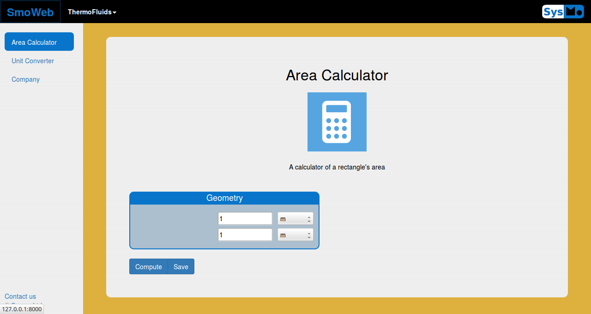
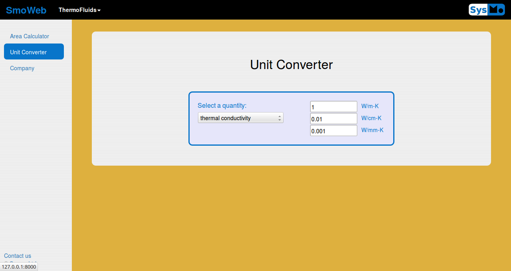
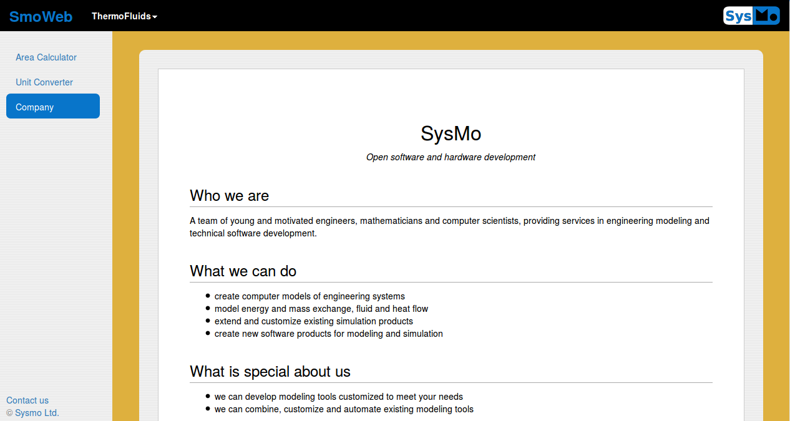

=================
Modular page view
=================
.. module:: smo.web.view

-----------------------
Page structure overview
-----------------------

.. figure:: img/pageorganizationalstructure.*
   :width: 600px

--------------
Creating pages
--------------
Modular page views are created by subclassing the :class:`ModularPageView` class::
   
   class HomeView(ModularPageView):
    name = "HomeView"
    label = "Home View"
    injectVariables = ['ModelCommunicator', 'variables']
    modules = [AreaCalculator, UnitConverterModule, Company]

A modular page consists of modules, which can be activated by the user by clicking on the corresponding pill
in the sidebar in the left of the page. 

   A modular page example
   
-------
Modules
-------

.. module:: smo.model.model

Page modules may be one of the following types:

:class:`NumericalModel`
-----------------------

   An active :class:`NumericalModel` module 

.. module:: smo.web.modules

:class:`HtmlModule`
-------------------

.. autoclass:: HtmlModule

   An active `HtmlModule` module 

:class:`RestModule`
-------------------

.. autoclass:: RestModule

   An active `RestModule` module 
