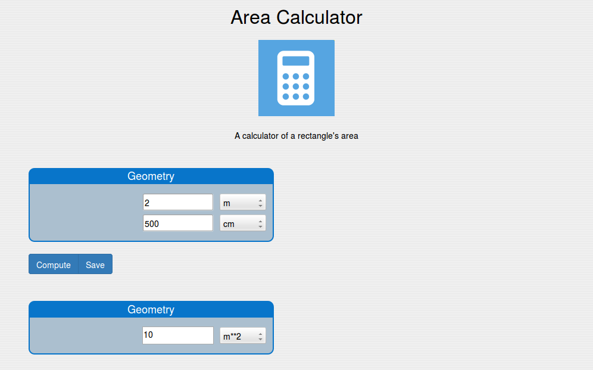

===============
Numerical model
===============

.. module:: smo.model.model

---------------
Defining models
---------------

Numerical models are defined by subclassing the :class:`NumericalModel` class::

   class AreaCalculator(NumericalModel):
    name = "AreaCalculator"
    label = "Area Calculator"
    figure = ModelFigure(src="img/Calculator.png", height=150, width=250)
    description = ModelDescription("A calculator of a rectangle's area", show = True)
    showOnHome = True
    
    ############# Inputs ###############
    # Fields
    width = Quantity('Length')
    length = Quantity('Length')
    geometryIn = FieldGroup([width, length], label = "Geometry")

    inputs = SuperGroup([geometryIn], label = "Inputs")
    
    # Actions
    computeAction = ServerAction("compute", label = "Compute", outputView = 'resultView')
    inputActionBar = ActionBar([computeAction], save = True)
    
    # Model view
    inputView = ModelView(ioType = "input", superGroups = [inputs], 
        actionBar = inputActionBar, autoFetch = True)  
    
    ############# Results ###############
    # Fields
    area = Quantity('Area')
    geometryOut = FieldGroup([area], label = "Geometry")
    
    results = SuperGroup([geometryOut], label = "Results")
    
    # Model view
    resultView = ModelView(ioType = "output", superGroups = [results])
    
    ############# Page structure ########
    modelBlocks = [inputView, resultView]
    
    ############# Methods ################
    def compute(self):
        self.area = self.width * self.length
         
The :class:`AreaCalculator` class defines 2 input fields (``width`` and ``length``) and one 
output field (``area``). The input fields are grouped in a field-group with label ``Geometry``,
which is part of a super-group with label ``Inputs``. The output field ``area`` is part of 
a field-group again with label ``Geometry`` (but a different one), which is part of the 
super-group ``Results``. The model is visualized with an input view, comprised of the ``Inputs`` super-group and 
a bar of buttons for carrying out actions (*Compute* to perform the calculation via the :func:`compute` method 
and *Save* to save the inputs), and a result view, consisting of the ``Results`` super-group. 

The numerical model may have a field named *figure*, an instance of :class:`~smo.model.fields.ModelFigure`, 
which represents the figure displayed with the model, as well as a field named *description*, 
an instance of :class:`~smo.model.fields.ModelDescription`,
providing a description that can be displayed at the model page and as a tooltip of the model's thumbnal on the home page. 
The resulting user interface in the browser can be seen in the following figure:

   User interface generated for the AreaCalculator class 

Available classes
-----------------

.. autoclass:: NumericalModelMeta

.. autoclass:: NumericalModel
   :special-members: __new__, __setattr__
   
---------------------------
Fields and field attributes
---------------------------

.. module:: smo.model.fields

:class:`Field` - field base class
---------------------------------

.. autoclass:: Field

All the fields also contain a private ``_name`` attribute, which is the name used to declare 
the field. This attribute is crated in the constructor of :class:`~smo.model.model.NumericalModelMeta`

:class:`Quantity`
-----------------

.. autoclass:: Quantity
   :show-inheritance:

:class:`String`
---------------

.. autoclass:: String
   :show-inheritance:

:class:`Boolean`
----------------

.. autoclass:: Boolean
   :show-inheritance:

:class:`Choices`
----------------

.. autoclass:: Choices
   :show-inheritance:

:class:`RecordArray`
--------------------

.. autoclass:: RecordArray
   :show-inheritance:

:class:`ObjectReference`
------------------------

.. autoclass:: ObjectReference
   :show-inheritance:

:class:`DataSeriesView`
-----------------------

.. autoclass:: DataSeriesView
   :show-inheritance:

:class:`TableView`
------------------

.. autoclass:: TableView
   :show-inheritance:

:class:`PlotView`
-----------------

.. autoclass:: PlotView
   :show-inheritance:

:class:`Image`
--------------

.. autoclass:: Image
   :show-inheritance:
   
:class:`MPLPlot`
----------------

.. autoclass:: MPLPlot
   :show-inheritance:
   
:class:`Port`
-------------

.. autoclass:: Port
   :show-inheritance:
   
:class:`SubModelGroup`
----------------------

.. autoclass:: SubModelGroup
   :show-inheritance:

:class:`ModelFigure`
--------------------

.. autoclass:: ModelFigure

:class:`ModelDescription`
-------------------------

.. autoclass:: ModelDescription

-------------------------------
Class fields vs instance fields
-------------------------------

A *class* field defines the structure of the field it refers to as part of the hierarchical structure of the model. 
It is included in the ``definitions`` property of the JSON object representing the model that is sent to the client.
By contrast, an *instance* field represents the value of the particular field, which is contained in the ``values`` attribute of
the JSON object.

------
Groups
------

:class:`Group`
--------------

.. autoclass:: Group

:class:`BasicGroup`
-------------------

.. autoclass:: BasicGroup
   :show-inheritance:

:class:`FieldGroup`
-------------------

.. autoclass:: FieldGroup
   :show-inheritance:

:class:`ViewGroup`
------------------

.. autoclass:: ViewGroup
   :show-inheritance:
   
:class:`SuperGroup`
-------------------

.. autoclass:: SuperGroup
   :show-inheritance:

-------
Actions
-------

.. module:: smo.model.actions

:class:`ServerAction`
---------------------

.. autoclass:: ServerAction

:class:`ActionBar`
------------------

.. autoclass:: ActionBar

----------
Model view
----------

:class:`ModelView`
------------------

.. autoclass:: smo.model.fields.ModelView