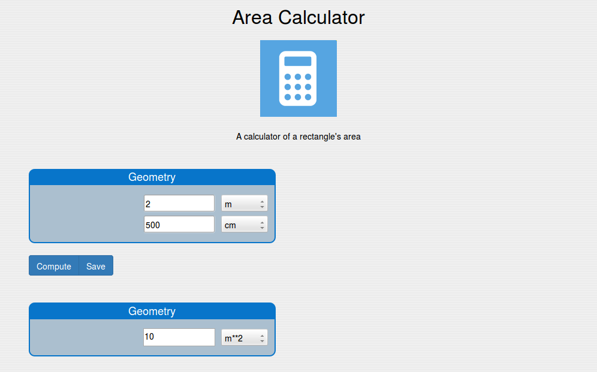

===============
Numerical model
===============
.. module:: smo.model.model

---------------
Creating models
---------------

Numerical models are defined by subclassing the :class:`NumericalModel` class::

   from smo.model.model import NumericalModel
   from smo.model.fields import *

   class AreaCalculator(NumericalModel):
      ############# Inputs ###############
      width = Quantity('Length')
      length = Quantity('Length')
      geometryIn = FieldGroup([width, length], label = "Geometry")
      
      inputs = SuperGroup([geometryIn], label = "Inputs")
      
      ############# Results ###############
      area = Quantity('Area')
      geometryOut = FieldGroup([area], label = "Geometry")
      
      results = SuperGroup([geometryOut], label = "Results")
      
      ############# Methods ################
      def compute(self):
         self.area = self.width * self.length
         
The :class:`AreaCalculator` class defines 2 input fields (``width`` and ``length``) and one 
output field (``area``). The input fields are grouped in a field-group with label ``Geometry``,
which is part of a super-group with label ``Inputs``. The output field ``area`` is part of 
a field-group again with label ``Geometry`` (but a different one), which is part of the 
super-group ``Results``. Finally, a method :func:`compute` calculates the area from the
width and the length. The resulting user interface in the browser can be seen in the figure.

   User interface generated for the AreaCalculator class 

Available classes
-----------------

.. autoclass:: NumericalModelMeta

.. todo::
   
   Inherited models must collect the fields from base classes

.. autoclass:: NumericalModel
   :special-members: __new__, __setattr__
   
---------------------------
Fields and field attributes
---------------------------

.. module:: smo.model.fields

:class:`Field` - field base class
---------------------------------

.. autoclass:: Field

All the fields also contain a private ``_name`` attribute, which is the name used to declare 
the field. This attribute is crated in the constructor of :class:`~smo.model.model.NumericalModelMeta`

:class:`Quantity`
-----------------

.. autoclass:: Quantity

:class:`String`
---------------

.. autoclass:: String

:class:`Boolean`
----------------

.. autoclass:: Boolean

:class:`Choices`
----------------

.. autoclass:: Choices

:class:`RecordArray`
--------------------

.. autoclass:: RecordArray

:class:`ObjectReference`
------------------------

.. autoclass:: ObjectReference

:class:`TableView`
------------------

.. autoclass:: TableView

:class:`PlotView`
-----------------

.. autoclass:: PlotView

-------------------------------
Class fields vs instance fields
-------------------------------

A *class* field defines the structure of the field it refers to as part of the hierarchical structure of the model. 
It is included in the ``definitions`` property of the JSON object representing the model that is sent to the client.
By contrast, an *instance* field represents the value of the particular field, which is contained in the ``values`` attribute of
the JSON object.   

------
Groups
------

:class:`Group`
--------------

.. autoclass:: Group

:class:`FieldGroup`
-------------------

.. autoclass:: FieldGroup

:class:`ViewGroup`
------------------

.. autoclass:: ViewGroup

:class:`SuperGroup`
-------------------

.. autoclass:: SuperGroup

------------
Page modules
------------

.. module:: smo.model.model

:class:`ModelView`
------------------

.. autoclass:: ModelView

:class:`HtmlModule`
-------------------

.. autoclass:: HtmlModule

:class:`RestBlock`
------------------

.. autoclass:: RestBlock